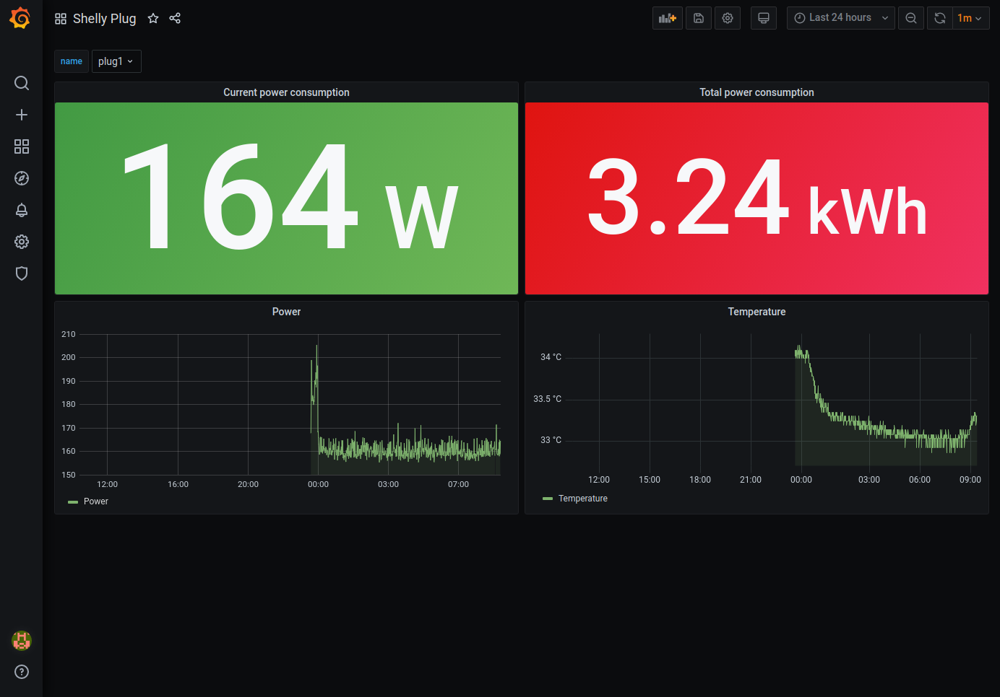
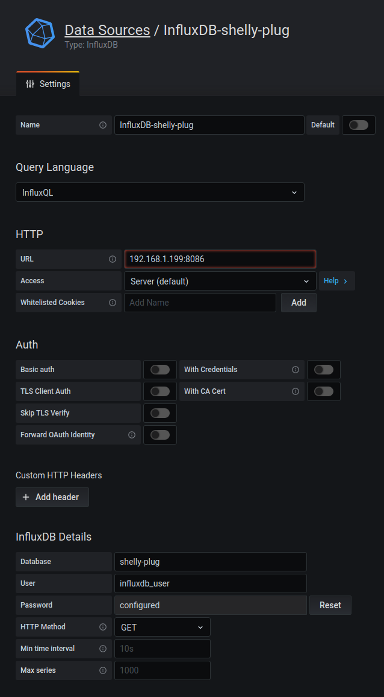

# About
Simple Shelly Plug data aggregator for influxDB + Grafana.




# Quick start

Docker:
```bash
docker run -d --restart unless-stopped \
    -e SHELLY_PLUG_NAME=living_room \
    -e SHELLY_PLUG_IP=192.168.1.171 \
    -e SHELLY_PLUG_USER=plug_user \
    -e SHELLY_PLUG_PASSWORD=plug_password \
    -e INFLUXDB_HOST=192.168.1.199 \
    -e INFLUXDB_PORT=8086 \
    -e INFLUXDB_DB=shelly-plug \
    -e INFLUXDB_ADMIN_USER=influxdb_user \
    -e INFLUXDB_ADMIN_PASSWORD=influxdb_password \
    knobik/shelly-plug-influxdb
```

* if the database provided in INFLUXDB_DB will not exist, then it will be created.

docker-compose.yml
```yml
version: '2'

services:
  shelly-plug-influxdb:
    restart: unless-stopped
    image: knobik/shelly-plug-influxdb
    environment:
      SHELLY_PLUG_NAME: 'living_room'
      SHELLY_PLUG_IP: '192.168.1.171'
      SHELLY_PLUG_USER: 'plug_user'
      SHELLY_PLUG_PASSWORD: 'plug_password'
      INFLUXDB_HOST: '192.168.1.199'
      INFLUXDB_PORT: '8086'
      INFLUXDB_DB: 'shelly-plug'
      INFLUXDB_ADMIN_USER: 'influxdb_user'
      INFLUXDB_ADMIN_PASSWORD: 'influxdb_password'
```

**Remember to create a datasource `InfluxDB-shelly-plug` in Grafana before importing the dashboard :)**  

